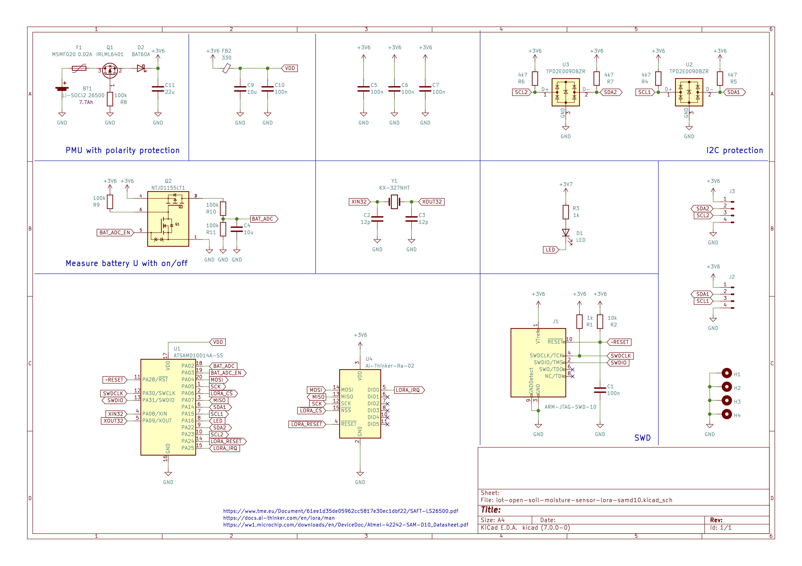

# IoT Soil Moisture Sensor

### Open source, low power, cost-effective, 10 years from 1 LiSOCl2 battery. LoRa communication channel. Supports 2 probes functionality for multi-depth sensoring.

### Based on [Microchip (Atmel) SAMD10 ](https://ww1.microchip.com/downloads/en/DeviceDoc/Atmel-42242-SAM-D10_Datasheet.pdf) chip: ~1.5$, 32bit Cortex M0+

## Features

- LoRa communication
- LiSOCl2 7.7A 26500 battery
- RTC clock
- 2 I2C SHTxx Senserion sensors
- Battery self-measure

## Schematics

## PCB

## PCB Renders

